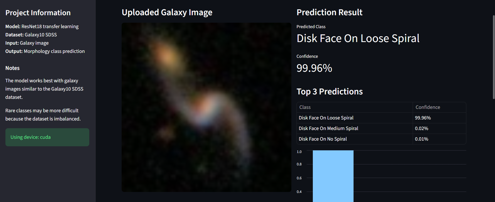
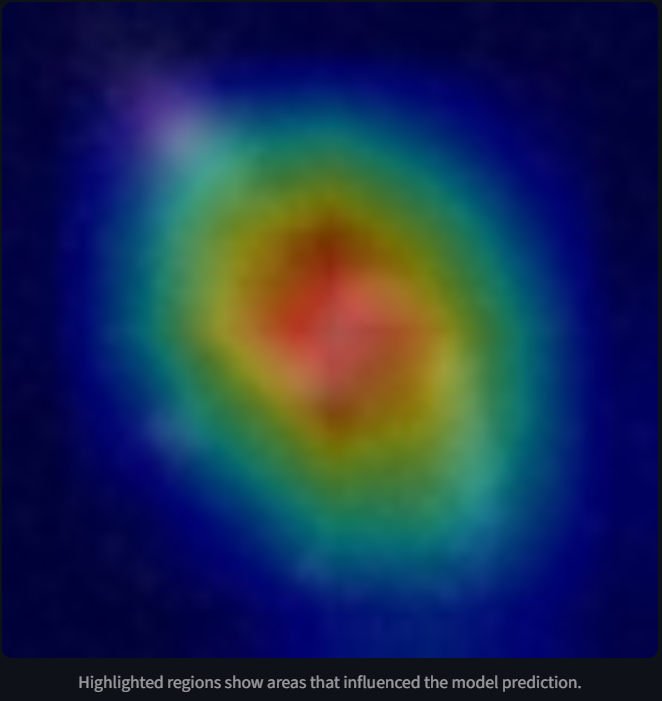
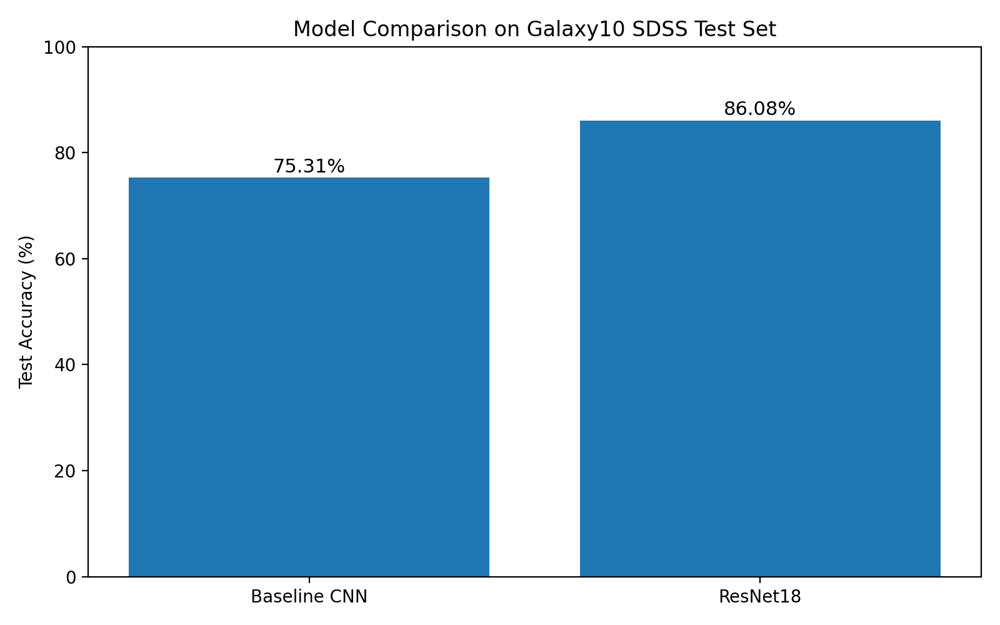
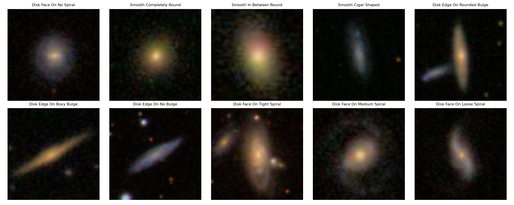
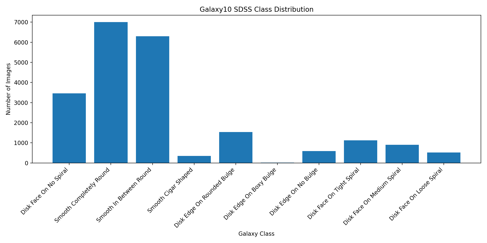
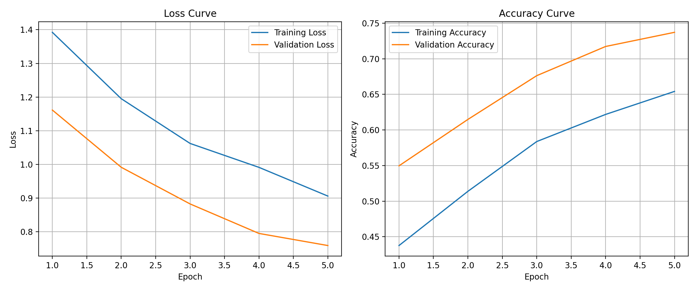
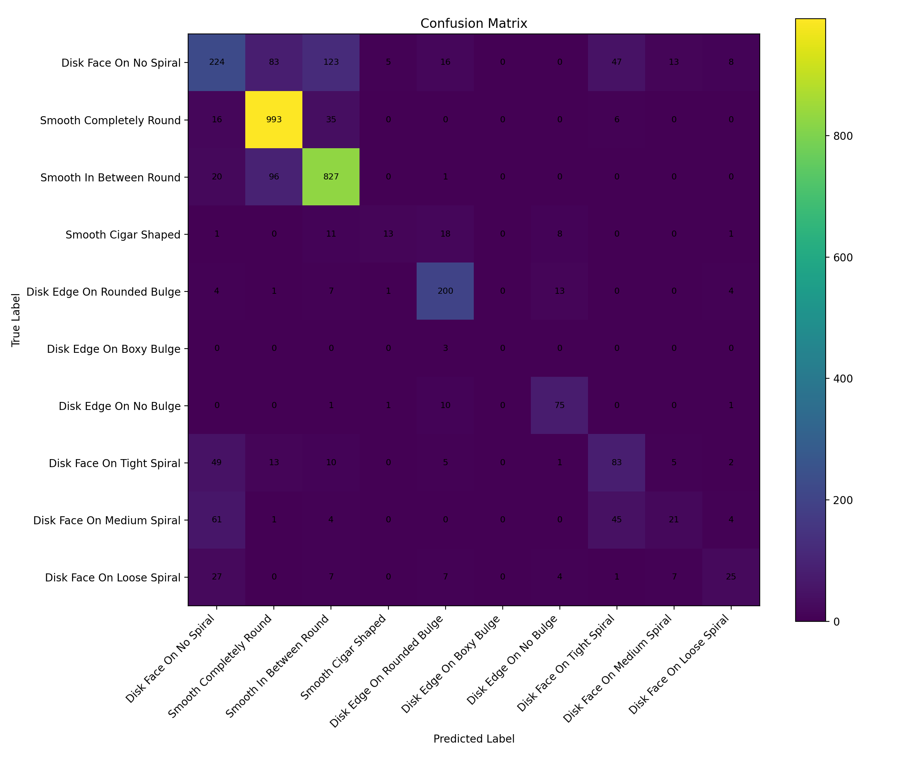
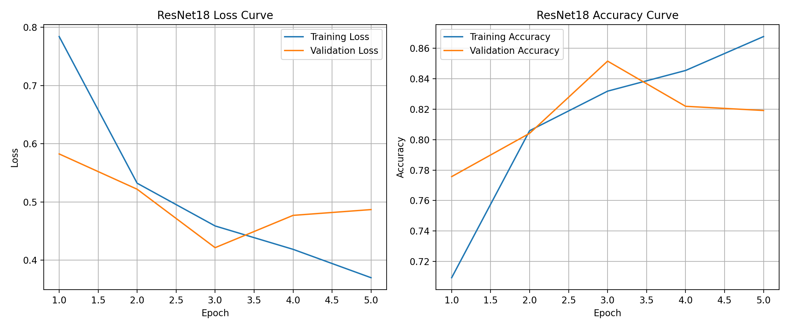
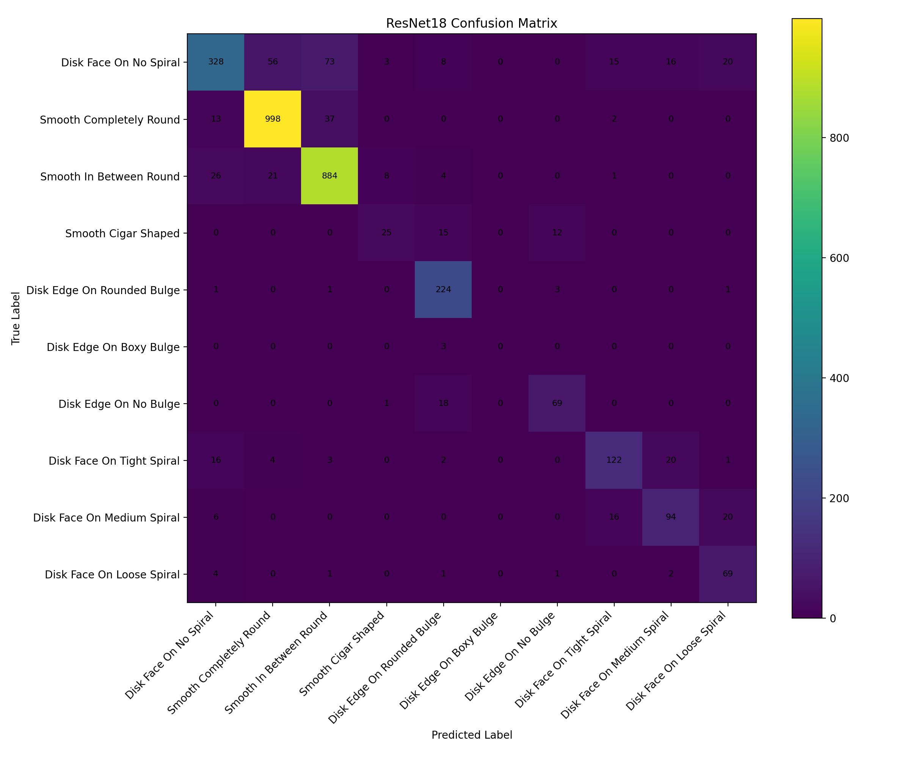
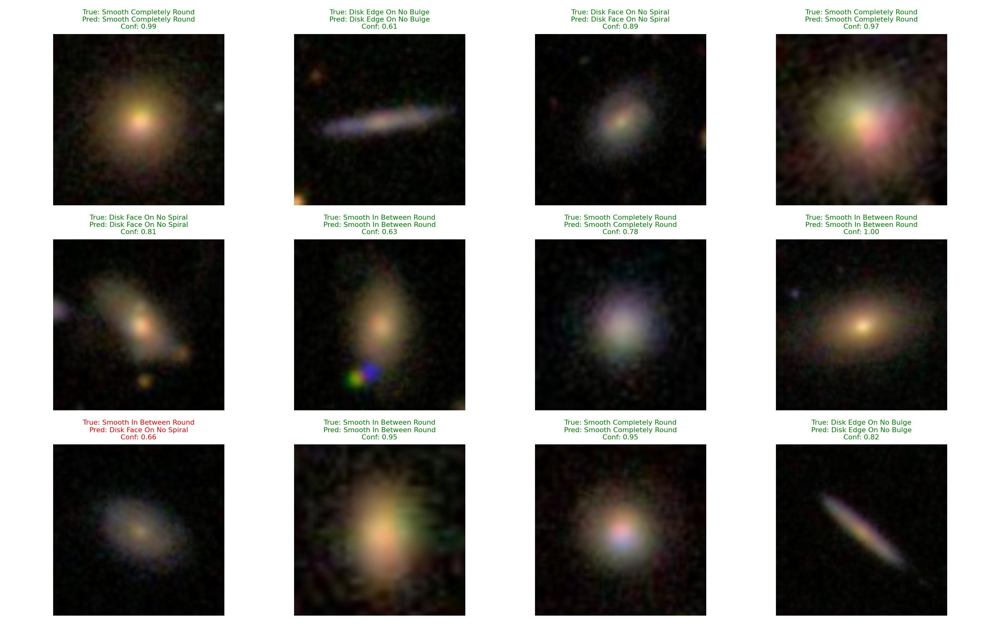

# Deep Learning Based Galaxy Morphology Classification from SDSS Images

A deep learning computer vision project for classifying galaxy morphology from astronomical images.

This project uses the Galaxy10 SDSS dataset and compares two different deep learning approaches:

1. A custom Convolutional Neural Network trained from scratch
2. A transfer learning model using ResNet18

The final ResNet18 model achieved **86.08% test accuracy**, improving over the baseline CNN by **10.77 percentage points**.

---

## Project Preview

### Streamlit Prediction App



### Grad CAM Explainability



### Model Comparison



---

## Project Overview

Galaxy morphology classification is the task of categorizing galaxies based on their visual structure, such as smooth elliptical galaxies, edge on disk galaxies, and spiral galaxies.

This project applies deep learning to classify galaxy images into 10 morphology classes using the Galaxy10 SDSS dataset. The goal is to build a complete machine learning workflow, including:

* Dataset inspection
* Image visualization
* Class distribution analysis
* PyTorch dataset and dataloader creation
* Baseline CNN training
* Transfer learning with ResNet18
* Model evaluation
* Confusion matrix analysis
* Prediction visualization
* Streamlit deployment interface
* Grad CAM model interpretability

This project is designed as a portfolio ready deep learning project combining astronomy, computer vision, and model explainability.

---

## Dataset

This project uses the **Galaxy10 SDSS** dataset.

The dataset contains **21,785 RGB galaxy images** from the Sloan Digital Sky Survey. Each image has a size of **69 x 69 pixels** and belongs to one of 10 galaxy morphology classes.

The labels are based on Galaxy Zoo classifications.

### Dataset Classes

| Class ID | Class Name                 | Number of Images |
| -------: | -------------------------- | ---------------: |
|        0 | Disk Face On No Spiral     |            3,461 |
|        1 | Smooth Completely Round    |            6,997 |
|        2 | Smooth In Between Round    |            6,292 |
|        3 | Smooth Cigar Shaped        |              349 |
|        4 | Disk Edge On Rounded Bulge |            1,534 |
|        5 | Disk Edge On Boxy Bulge    |               17 |
|        6 | Disk Edge On No Bulge      |              589 |
|        7 | Disk Face On Tight Spiral  |            1,121 |
|        8 | Disk Face On Medium Spiral |              906 |
|        9 | Disk Face On Loose Spiral  |              519 |

### Example Galaxy Images



### Class Distribution



### Dataset Note

The dataset is highly imbalanced. Some classes contain thousands of examples, while others contain very few examples. For example, the `Disk Edge On Boxy Bulge` class contains only 17 images in the full dataset.

This imbalance strongly affects model performance, especially for rare classes.

The dataset file is not included in this repository because it is large. To run the project locally, download the Galaxy10 SDSS dataset and place it here:

```text
data/raw/galaxy10.h5
```

---

## Methods

This project uses two deep learning approaches.

### 1. Baseline CNN

The first model is a custom Convolutional Neural Network built with PyTorch.

The baseline CNN includes:

* Convolutional layers
* Batch normalization
* ReLU activations
* Max pooling
* Dropout
* Fully connected classification layers

This model was trained from scratch on the Galaxy10 dataset.

The purpose of the baseline model is to create a simple reference point before using transfer learning.

### 2. ResNet18 Transfer Learning

The second model uses ResNet18 with pretrained ImageNet weights.

The final classification layer was replaced with a new linear layer for 10 galaxy morphology classes.

The ResNet18 model was fine tuned on the Galaxy10 dataset using resized 224 x 224 galaxy images.

Transfer learning improved performance because the pretrained model already learned useful visual features such as edges, curves, textures, and shapes.

## Results

### Test Accuracy Comparison

| Model                      | Test Accuracy |
| -------------------------- | ------------: |
| Baseline CNN               |        75.31% |
| ResNet18 Transfer Learning |        86.08% |

The ResNet18 model improved test accuracy by **10.77 percentage points** compared to the baseline CNN.


---

## Baseline CNN Results

The baseline CNN achieved:

```text
Test Accuracy: 75.31%
```

The baseline model performed well on large and visually clear classes, especially smooth galaxies and some edge on disk galaxies. However, it struggled with spiral classes and rare classes.

### Baseline CNN Training Curves



### Baseline CNN Confusion Matrix



### Baseline CNN Classification Report Summary

| Class                      | F1 Score |
| -------------------------- | -------: |
| Disk Face On No Spiral     |     0.49 |
| Smooth Completely Round    |     0.89 |
| Smooth In Between Round    |     0.84 |
| Smooth Cigar Shaped        |     0.36 |
| Disk Edge On Rounded Bulge |     0.82 |
| Disk Edge On Boxy Bulge    |     0.00 |
| Disk Edge On No Bulge      |     0.79 |
| Disk Face On Tight Spiral  |     0.47 |
| Disk Face On Medium Spiral |     0.23 |
| Disk Face On Loose Spiral  |     0.41 |

---

## ResNet18 Results

The ResNet18 transfer learning model achieved:

```text
Test Accuracy: 86.08%
```

The ResNet18 model significantly improved performance, especially on spiral galaxy classes.

### ResNet18 Training Curves



### ResNet18 Confusion Matrix



### ResNet18 Classification Report Summary

| Class                      | Precision | Recall | F1 Score | Support |
| -------------------------- | --------: | -----: | -------: | ------: |
| Disk Face On No Spiral     |      0.83 |   0.63 |     0.72 |     519 |
| Smooth Completely Round    |      0.92 |   0.95 |     0.94 |    1050 |
| Smooth In Between Round    |      0.88 |   0.94 |     0.91 |     944 |
| Smooth Cigar Shaped        |      0.68 |   0.48 |     0.56 |      52 |
| Disk Edge On Rounded Bulge |      0.81 |   0.97 |     0.89 |     230 |
| Disk Edge On Boxy Bulge    |      0.00 |   0.00 |     0.00 |       3 |
| Disk Edge On No Bulge      |      0.81 |   0.78 |     0.80 |      88 |
| Disk Face On Tight Spiral  |      0.78 |   0.73 |     0.75 |     168 |
| Disk Face On Medium Spiral |      0.71 |   0.69 |     0.70 |     136 |
| Disk Face On Loose Spiral  |      0.62 |   0.88 |     0.73 |      78 |

### ResNet18 Overall Metrics

| Metric                    | Score |
| ------------------------- | ----: |
| Accuracy                  |  0.86 |
| Macro Average F1 Score    |  0.70 |
| Weighted Average F1 Score |  0.86 |

---

## Key Observations

The ResNet18 model performed much better than the baseline CNN.

The largest improvements were seen in the spiral galaxy classes:

| Class                      | Baseline CNN F1 | ResNet18 F1 |
| -------------------------- | --------------: | ----------: |
| Disk Face On Tight Spiral  |            0.47 |        0.75 |
| Disk Face On Medium Spiral |            0.23 |        0.70 |
| Disk Face On Loose Spiral  |            0.41 |        0.73 |

This shows that transfer learning helped the model learn more useful visual features for galaxy morphology.

However, the rarest class, `Disk Edge On Boxy Bulge`, still had poor performance. This is expected because the full dataset contains only 17 examples of this class, and the test set contains only 3 examples.

This highlights an important machine learning challenge: high overall accuracy does not always mean strong performance on every class.

---

## Prediction Examples

The project includes prediction examples from the ResNet18 model.

Each example shows:

* True class
* Predicted class
* Confidence score



---

## Grad CAM Explainability

This project includes Grad CAM visualization for the ResNet18 model.

Grad CAM highlights the image regions that influenced the model prediction. This helps make the model more interpretable by showing where the network focused when classifying a galaxy image.


Grad CAM is useful because it helps answer not only:

```text
What class did the model predict?
```

but also:

```text
Which part of the image influenced the prediction?
```

## Streamlit App

The project includes an interactive Streamlit application.

The app allows users to:

* Upload a galaxy image
* Run ResNet18 prediction
* View the predicted morphology class
* View confidence score
* View top 3 predicted classes
* View a Grad CAM explanation

### App Features

| Feature           | Description                                          |
| ----------------- | ---------------------------------------------------- |
| Image Upload      | Upload a galaxy image in JPG, JPEG, or PNG format    |
| Prediction        | Classify the galaxy using the trained ResNet18 model |
| Confidence Score  | Display the model confidence for the top prediction  |
| Top 3 Predictions | Show the three most likely classes                   |
| Bar Chart         | Visualize top prediction probabilities               |
| Grad CAM          | Show which image regions influenced the prediction   |

---

## Project Structure

```text
galaxy-morphology-classification/
│
├── app.py
├── README.md
├── requirements.txt
├── .gitignore
│
├── data/
│   ├── raw/
│   │   └── galaxy10.h5
│   └── processed/
│
├── models/
│   ├── baseline_cnn.pth
│   └── resnet18_galaxy.pth
│
├── outputs/
│   ├── figures/
│   │   ├── sample_galaxies.png
│   │   ├── class_distribution.png
│   │   ├── training_curves.png
│   │   ├── resnet18_training_curves.png
│   │   ├── confusion_matrix.png
│   │   ├── resnet18_confusion_matrix.png
│   │   └── model_comparison.png
│   │
│   └── predictions/
│       ├── sample_predictions.png
│       ├── resnet18_sample_predictions.png
│       └── test_galaxy_images/
│
├── screenshots/
│   ├── sample_galaxies.png
│   ├── class_distribution.png
│   ├── training_curves.png
│   ├── resnet18_training_curves.png
│   ├── confusion_matrix.png
│   ├── resnet18_confusion_matrix.png
│   ├── model_comparison.png
│   ├── resnet18_sample_predictions.png
│   ├── streamlit_app.png
│   └── gradcam_example.png
│
└── src/
    ├── __init__.py
    ├── dataset.py
    ├── model.py
    ├── train.py
    ├── train_resnet.py
    ├── evaluate.py
    ├── evaluate_resnet.py
    ├── predict.py
    ├── gradcam.py
    ├── inspect_dataset.py
    ├── visualize_samples.py
    ├── plot_class_distribution.py
    ├── plot_training_history.py
    ├── plot_resnet_history.py
    ├── plot_model_comparison.py
    ├── save_predictions.py
    ├── save_resnet_predictions.py
    ├── export_test_images.py
    ├── test_environment.py
    ├── test_dataloader.py
    └── test_model.py
```

---

## Installation

### 1. Clone the repository

```bash
git clone https://github.com/YOUR_USERNAME/galaxy-morphology-classification.git
cd galaxy-morphology-classification
```

### 2. Create a virtual environment

On Windows:

```bash
python -m venv venv
venv\Scripts\activate
```

On macOS or Linux:

```bash
python -m venv venv
source venv/bin/activate
```

### 3. Install dependencies

```bash
pip install -r requirements.txt
```

---

## Dataset Setup

Download the Galaxy10 SDSS dataset and place the file here:

```text
data/raw/galaxy10.h5
```

The expected file structure is:

```text
data/
└── raw/
    └── galaxy10.h5
```

The dataset file is not included in this repository because it is large.

---

## How to Run

### 1. Test the environment

```bash
python src/test_environment.py
```

### 2. Inspect the dataset

```bash
python src/inspect_dataset.py
```

### 3. Visualize sample galaxies

```bash
python src/visualize_samples.py
```

### 4. Plot class distribution

```bash
python src/plot_class_distribution.py
```

### 5. Train the baseline CNN

```bash
python src/train.py
```

### 6. Evaluate the baseline CNN

```bash
python src/evaluate.py
```

### 7. Train the ResNet18 model

```bash
python src/train_resnet.py
```

### 8. Evaluate the ResNet18 model

```bash
python src/evaluate_resnet.py
```

### 9. Run the Streamlit app

```bash
streamlit run app.py
```

---

## Requirements

The main libraries used in this project are:

```text
torch
torchvision
numpy
pandas
matplotlib
scikit-learn
h5py
streamlit
pillow
opencv-python
tqdm
```

---

## Model Files

The trained model files are not included in this repository because they can be large.

Expected local model files:

```text
models/baseline_cnn.pth
models/resnet18_galaxy.pth
```

To generate these files, run:

```bash
python src/train.py
python src/train_resnet.py
```

The Streamlit app uses:

```text
models/resnet18_galaxy.pth
```

---

## Limitations

This project has several limitations:

1. The dataset is highly imbalanced.
2. Some classes have very few examples.
3. The model performs poorly on extremely rare classes.
4. The images are low resolution.
5. The model works best on images similar to the Galaxy10 SDSS dataset.
6. External galaxy images may require preprocessing before prediction.
7. Galaxy Zoo labels are based on human classification and may contain uncertainty.

---

## Future Improvements

Possible improvements include:

* Use class weighted loss to reduce the effect of class imbalance
* Try oversampling or data augmentation for rare classes
* Train a larger transfer learning model such as ResNet50 or EfficientNet
* Add early stopping during training
* Add learning rate scheduling
* Add Grad CAM export as downloadable output
* Deploy the Streamlit app online
* Add support for batch image prediction
* Compare more deep learning architectures
* Use higher resolution galaxy images

---

## What I Learned

Through this project, I practiced:

* Deep learning with PyTorch
* CNN model design
* Transfer learning with ResNet18
* Astronomical image classification
* Dataset inspection and visualization
* Handling imbalanced datasets
* Model evaluation with precision, recall, and F1 score
* Confusion matrix analysis
* Streamlit app development
* Grad CAM model explainability
* Git and GitHub project organization

---

## Tech Used

* Python
* PyTorch
* Torchvision
* ResNet18
* Streamlit
* OpenCV
* NumPy
* Pandas
* Matplotlib
* Scikit learn
* h5py
* Pillow
* Git
* GitHub

---

## Author

Created by **Mohammad Eslamifar**

This project was built as a deep learning portfolio project combining astronomy, computer vision, and model interpretability.

---

## Acknowledgements

This project uses the Galaxy10 SDSS dataset, which is based on galaxy images from the Sloan Digital Sky Survey and labels from Galaxy Zoo.

Special thanks to the open source machine learning and astronomy communities for making datasets and tools available for educational and research projects.

